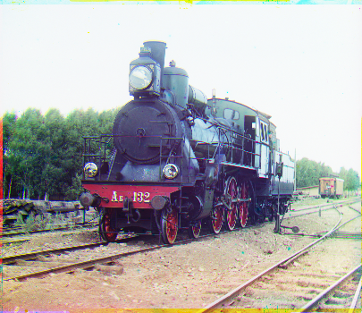

# Computational Photograpy: Prokudin-Gorsky Channel Allignment

This program can be used to allign Prokudin-Gorsky photos to RGB images. The results of my attempt can be checked in `samples` directory. The dataset can be downloaded form `dataset.zip` and further results can be seen on `align_testet.py`.
 
 ### Three Color Channel Images
 .png)

### RGB Image
 

Resources
- [UC Berkeley](https://inst.eecs.berkeley.edu/~cs194-26/fa18/hw/proj1/)
- [Brown University](https://cs.brown.edu/courses/cs129/asgn/proj1_alignment/index.html)
- [University of Toronto](https://www.cs.toronto.edu/~guerzhoy/320/proj1/)

